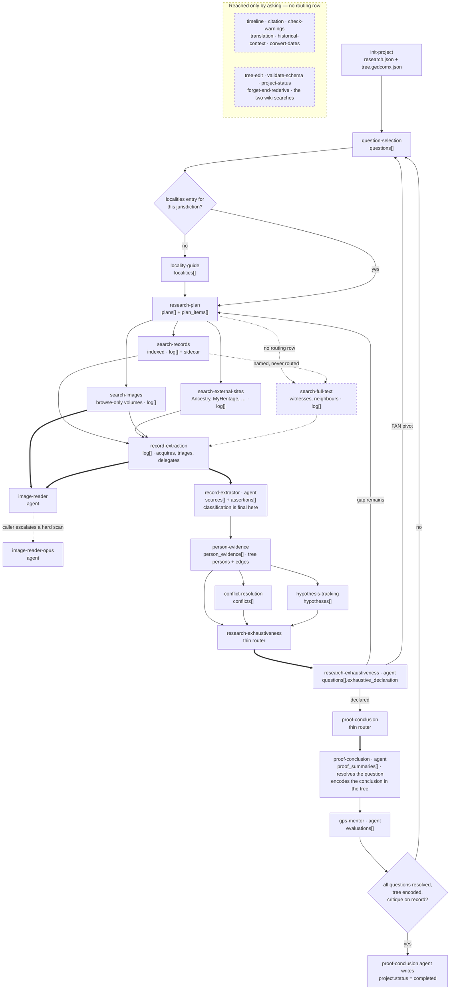

# Skills and agents — the data flow

What runs when, what each unit owns, and what it touches. If you want the research
*method*, read [`gps-research-flow.md`](gps-research-flow.md) first — this file is the
mechanics underneath it.

**Two files are authoritative and this one is not.** The order and the gates come from
the routing table in `packages/engine/plugin/skills/research/SKILL.md` — the table whose
header row reads `| If research.json has... | Invoke |`. Who may write each section of
persisted state comes from [`specs/schemas/ownership.json`](specs/schemas/ownership.json).
This file maps the two onto each other so you can see a whole run at once; where it
disagrees with either, they win.

There are 27 skills and 6 agents. Besides the `research` orchestrator itself, its routing
table names 13 of them, and 5 more are reached by delegation from a skill the table does
name. The remaining 14 fire only when the user asks — see
[Reachable only by asking](#reachable-only-by-asking), which is the part of this doc most
likely to surprise you.

---

## Three shapes

**Thin router + agent.** The skill resolves the request to one id, delegates, and relays
the result. It reads almost nothing and writes nothing; the agent holds the judgment and
the writer tool. Three pairs today: `record-extraction` → `record-extractor`,
`research-exhaustiveness` → `research-exhaustiveness`, `proof-conclusion` →
`proof-conclusion`. The split exists because only an agent carries an `agent_id`, which
is what lets the `PreToolUse` hook route a section's writes to exactly one caller.

**Monolithic skill.** Reads state, does the work, writes its own section. Most skills.

**Leaf agent.** Called by a skill, calls nothing (agents cannot nest agents), returns
text. `image-reader`, `image-reader-opus`, `gps-mentor`.

---

## The flow

Solid arrow: the orchestrator routes here on `research.json` state. Thick arrow: a skill
delegates to its agent. Dotted: a prose handoff with no routing row behind it —
`search-full-text` is drawn dashed for that reason, and everything in the bottom box is
unreachable from an autonomous run.

---

## The loop, in call order

| # | Skill / agent | Gate — true before it runs | Owns | Reads | Writes |
|---|---|---|---|---|---|
| 0 | **`init-project`** (skill) | No `research.json` in the folder. A guard clause refuses — reading no project file at all — if one exists. Not a routing row; `/research` names it in prose. | Creating both project files, the researcher profile, and the known-holdings survey | `person_read` (with `relatives` + `sourceDescriptions`), `person_search`, `place_search`; the user's opening answers | `research.json` `project` + empty sections and `tree.gedcomx.json` `persons`/`relationships`/`sources` — `project_create`; then `researcher_profile` and `known_holdings` — `research_append` |
| 1 | **`research`** (skill, orchestrator) | Entry point. `research.json` exists. | Routing only — plus the four contracts that forbid it doing the work inline (extraction, identity links, conflict/hypothesis, exhaustiveness/proof), and the two completion gates | `research_query` projections only; it explicitly bans a whole-file `Read` of `research.json` for itself | **Nothing.** The file still instructs it to write `project.status = "completed"`; that was ruled to the `proof-conclusion` agent on 2026-08-25 and the prose has not caught up — see [How the project gets closed](#how-the-project-gets-closed) |
| 2 | **`question-selection`** | Objective but no questions; or exhaustiveness returned gaps and the next move is a FAN pivot; or new evidence raised a new question | Minting at most one `q_` per invocation with its selection basis. Not a question's `status` after creation — all four transitions belong elsewhere | `research.json` `project.objective`, `questions`, `assertions`, `conflicts`, `hypotheses`, `timelines`, `log`, `proof_summaries`; tree `persons`. Conditional whole-file `Read` | `questions[]` append — `research_append`. Never `project.status` — when its step 1b stop point fires ("no further questions — objective answered") it returns a signal and the orchestrator re-invokes `proof-conclusion` to make the write |
| 3 | **`locality-guide`** | A question has no plan **and** its target jurisdiction has no `localities` entry | The survey of what records survive for one place and period, persisted as the one `loc_` entry `research-plan` plans from | `place_search`, `place_search_all`, `place_population`, `collections_search`, `volume_search`, `external_links_search`, `wiki_search`, `wiki_read`, `wiki_place_page` — the hosted wiki API and Pop Stats | `localities` — one entry per jurisdiction, `research_append`. Nothing at all in standalone Q&A with no project |
| 4 | **`research-plan`** | A question has no plan and its jurisdiction **already has** a `localities` entry; or exhaustiveness returned gaps to fill | Plan and plan-item structure — the sequenced record sets, their repositories, reasons and fallbacks. Never surveys a locality, never runs a search | `research.json` questions / plans / localities / log / assertions / proof_summaries and tree persons, by whole-file `Read`; `collections_search`, `volume_search` | `plans` and `plan_items` in one batched `research_append`; `plans[].status` → `superseded` or `exhausted` |
| 5a | **`search-records`** | Plan items not yet executed and no analyzed evidence plausibly answers the question; target is a FamilySearch indexed collection | Executing one already-chosen indexed search, triaging ranked candidates, logging every search including nil results | `record_search`, `rank_search_matches`, `record_read`, `research_query` (at most one call), tree persons | `log[]` + its `results/<log_id>.json` sidecar — `research_log_append`; `plans[].items[].status` — `research_append`. Never `completed` |
| 5b | **`search-external-sites`** | Same row, but the plan item targets Ancestry, MyHeritage, FindMyPast, FindAGrave or Newspapers.com | Constructing the pre-filled URL and triaging the PDF the user brings back. Never loads an external page | `research.json` `plans[]` and `researcher_profile.subscriptions` by whole-file `Read`; `place_search`, `external_links_search`, `collections_search`; the user's uploaded PDF | Two or three `log[]` entries — `research_log_append`; `plans[].items[].status = "completed"` — `research_append` |
| 5c | **`search-images`** | A plan item targets a digitized-but-unindexed record set (`volume_search` shows ~0% record-searchable), or indexed and full-text search are spent | Browsing a volume page by page. Never reads an image in its own context | `volume_search`, `image_search`; page text returned by `@plugin:image-reader` | `log[]` — `research_log_append`, **no sidecar** (`image_search` stages nothing); `plans[].items[].status` |
| 5d | **`search-full-text`** | **No routing row names it.** Reached by a prose handoff from `search-records`/`search-images`, or a direct request. Its own step 1 picks the next `planned` full-text item | Lucene-style search over FamilySearch's AI-transcribed images — the only lane that finds a person as witness, bondsman, appraiser or neighbour rather than as principal | `fulltext_search`, `source_attachments`; `research.json` `plans[]`, `log[]`, `assertions` by whole-file `Read` | `log[]` + sidecar — `research_log_append`; `plans[].items[].status` |
| — | **`image-reader`** (agent) | Delegated by `record-extraction` or `search-images`, once per image. Mandatory when the user supplies an image — the caller may not pre-judge that a scan is unreadable | One `image_transcribe` call, so the raw scan never enters the caller's context | The scan, fetched host-side and OCR'd by Qwen3-VL through OpenRouter. No project file | Nothing. Host-side side effect only: `images/<key>.jpg` when `project_path` is passed |
| — | **`image-reader-opus`** (agent) | Only after the fast reader returned an unreliable transcription, and only on scans under ~700 KB raw — its tool refuses larger ones, which the fast reader does not | The same one-page read, using Opus's own vision instead of the hosted OCR model | The scan, returned inline by `image_read`. No project file | Nothing; same `images/<key>.jpg` side effect |
| 6 | **`record-extraction`** (skill) | **Any** `log[]` entry with a positive or partial outcome and no assertion referencing it — even one, even late in a run. The orchestrator forbids extracting inline | Acquiring and triaging record input (search stub, ARK, PDF, image), writing the log entry when no search skill did, and one delegation per record | `record_read`, `volume_search`, the user's PDF. Explicitly **never** the `results/` sidecar — it already holds each `recordId` | `log[]` + sidecar — `research_log_append`. Nothing else; it holds no persistence tool |
| 6 | **`record-extractor`** (agent) | Delegated once per record, carrying `projectPath`, `recordId`, `logId`, and either the content or a `resultsRef` | Every assertion in one record and its three-layer GPS classification — **first and final**; no downstream refinement pass exists | `project_context` (one call), `record_read` against the sidecar, the delegated content, `record_person_matches` / `record_record_matches` on request. Never reads `research.json` or the tree | `sources` + `assertions` in one composite `extraction_append`, which also mints the mirroring tree `S` source description. **Cannot** write `person_evidence` — the tool's section enum is exactly those two |
| 7 | **`person-evidence`** | Assertions not yet linked to persons. Always the skill — writing a `pe_` link inline is how a same-named stranger's record gets attached to the subject | The identity decision — which tree person each persona is — scored with `same_person` first; and the household skeleton the link requires | `research_query` projections on `assertions` and `person_evidence`; `results/<log_id>.json`; `tree.gedcomx.json` walked directly | `person_evidence` — `research_append`; tree `persons` and their sourced facts — `materialize_facts`; tree `relationships` (a household record's ParentChild and Couple edges only) — `tree_edit` |
| 8 | **`conflict-resolution`** | Evidence conflicts present. Inline elimination of a namesake, or comparing two records for shared identity, is forbidden anywhere else | `conflicts` — independence analysis, the weighing, and the resolution rationale or the documented deferral | `research.json` `assertions`, `person_evidence`, `timelines`, `conflicts` by whole-file `Read`; `place_search`, `place_distance`, `convert_calendar` | `conflicts[]` only — `research_append` |
| 9 | **`hypothesis-tracking`** | Identity uncertainty across assertions | `hypotheses` — the `active` → `supported` / `ruled_out` transitions and the reasoning behind each | `research.json` `hypotheses`, `assertions`, `person_evidence`, `questions` by whole-file `Read` | `hypotheses[]` only — `research_append` |
| 10 | **`research-exhaustiveness`** (skill) | Analyzed evidence now plausibly answers the question — **even with plan items still `planned`**; or all items `completed`/`skipped` | Resolving the request to one `q_` by matching question **text**, delegating, relaying. It judges nothing and reads nothing else | `project_context` `openQuestions` only. `questionStatuses` is advisory and may never rule a question in or out | Nothing |
| 10 | **`research-exhaustiveness`** (agent) | Delegated with `questionId` + `projectPath`. Refuses while any plan item is `in_progress` | The five threshold questions and the seven stop criteria. The **only** caller permitted to set `exhaustive_declaration.declared: true` | `research_query` joins across `questions`, `plans`/`plan_items`, `log`, `assertions`, `person_evidence`; `Read` also granted | `questions[].exhaustive_declaration`, and on the declare path only `questions[].status = "exhaustive_declared"` — one `research_append` update |
| 11 | **`proof-conclusion`** (skill) | A question at `exhaustive_declared` with no `proof_summaries` entry; or re-invoked because a tier-≥-probable conclusion is not yet in the tree | Resolving to one `q_` and delegating. Reads nothing else and forms no view on readiness | `project_context` only | Nothing — the section is denied to it at the hook |
| 11 | **`proof-conclusion`** (agent) | Delegated with `questionId` + `projectPath`. Its own three-check gate — unresolved conflicts, unclassified assertions, unlinked persons — hard-blocks before Step 1 | Tier and form selection, the self-contained narrative, and the tree encoding | `research_query` projections (never a raw whole-file `Read`), `sources[].citation`, tree facts and relationships, `source_attachments`, `merge_warnings` | `proof_summaries[]` + the question's `status`/`resolved`/`resolution_assertion_ids` in one batch, and `project` — `research_append`; tree `relationships`, `persons[].facts[]` and `sources` at tier ≥ probable — `tree_edit` / `tree_correct` |
| 12 | **`gps-mentor`** (agent) | `proof-conclusion` wrote a `ps_id`, and either tier < probable or the conclusion is now in the tree. Skipped when `evaluations/` already holds a `proof-critique-<ps_id>-*.json` newer than the summary | One structured advisory verdict on the finished proof, read as a standalone document. **Mandatory to invoke and record; advisory in what it recommends.** It holds no search tool — it grades what was gathered | `project_context`, `research_query` (`evaluations`, `conflicts`, `hypotheses`, and the proof's `narrative_markdown`), the `evaluations/` verdict files, `validate_research_schema`, `collections_search` | `evaluations[]` in `research.json` — `research_append` — plus `superseded_by` on the prior entry for the same focus and target. The verdict file under `evaluations/` is written by the tool, not by the agent |
| 13 | **`proof-conclusion`** (agent), re-entered | Every question `resolved`, **and** both gates pass: each tier-≥-probable conclusion encoded in the tree, and each resolved question's `ps_id` carrying a `proof-critique` verdict. The orchestrator routes here; it does not write | Closing the project | `research_query` | `project.status = "completed"` — `research_append`, refused by the tool while a blocking conflict is unresolved or a mentor verdict is missing |

---

## How the project gets closed

Three components meet at the last step, and the split is easy to get wrong because each
one holds a piece of the answer.

| Component | Holds | Does not hold |
|---|---|---|
| **`question-selection`** | Whether the **objective** is answered. Its step 1b is the autonomous stop point: every *independent* part of the objective `resolved` with a `proof_summary` at `probable` or better, with corroboration explicitly not required | Any write to `project`. It signals and returns |
| **`research`** (orchestrator) | The routing decision — which component runs next, and re-invoking `proof-conclusion` once the stop point is reached | The write. It has no `research_append` grant in its own `allowed-tools` |
| **`proof-conclusion`** (agent) | The `project.status = "completed"` write, alongside the two gates that guard it — every tier-≥-probable conclusion encoded in the tree, and a `proof-critique` verdict on record for each resolved question's `ps_id` | Any view of `project.objective`. It never reads that field |

Ruled 2026-08-25 on issue #1335, against a routing table that still says the orchestrator
writes it. Three planes already match the ruling: the `project` row of the ownership
manifest, `research_append`'s own comment, and the `PreToolUse` hook, whose
`AGENT_WRITABLE_SECTIONS` grants the proof-conclusion agent `project`. The hook permits
that agent; it denies the orchestrator nothing, because `project` is not in
`OWNED_SECTIONS`.

**The condition the agent fires on is not the condition that should close a project.**
`agents/proof-conclusion.md` step 8 writes `completed` when "ALL questions are now
`resolved`". Since PR #1819 that agent also resolves the question it concluded, in the
same batch as the summary — so its own condition is true the moment it finishes the
**first** question of an objective that will need a second one, before
`question-selection` has minted the next. The agent cannot tell the two cases apart: it
holds no view of the objective, and "all questions resolved" is a proxy that is briefly
true on the way to every multi-question objective.

What closes the gap is the re-invocation seam, not a wider condition: `question-selection`
returns its stop-point signal, the orchestrator re-invokes `proof-conclusion`, and that
call makes the write. Do not instead widen step 8's condition — the agent has nothing to
evaluate it against. Tracked on issue #1335 as a consequence of the ruling.

---

## Outside the loop

Nothing routes to these. They fire when the user asks, or on a prose handoff from a
sibling skill.

| Skill | Triggered by | Owns | Reads | Writes |
|---|---|---|---|---|
| **`project-status`** | "where are we", opening an existing project | The resume summary — plain-language first, then GPS state — plus broken-foreign-key detection | Whole-file `Read` of both project files, deliberately | Nothing |
| **`timeline`** | "build a timeline"; handoffs from `person-evidence`, `conflict-resolution`, `hypothesis-tracking` | `timelines` — regenerated wholesale, never edited entry by entry — with gaps and geographic feasibility | `research.json` `person_evidence`, `assertions`, `hypotheses`, `timelines`, `conflicts` by whole-file `Read`; `place_search`, `place_distance` | `timelines[]` — `research_append` |
| **`citation`** | "fix this citation", "format to Evidence Explained" | Refining `citation` and the six `citation_detail` fields on a source that already exists. **Never creates one** | Whole-file `Read` of `research.json` `sources` and `log`; tree source descriptions | `sources[].citation`, `.citation_detail`, `.notes` — `research_append` `op: "update"` only |
| **`check-warnings`** | After any tree edit or merge; after `person-evidence` mints persons; "check for problems" | Running the offline impossibility check and the live FamilySearch quality score, and interpreting both. Never fixes anything | `person_warnings` (offline, deterministic), `person_quality` (live FamilySearch); the tree only to resolve a name to an id | Nothing |
| **`tree-edit`** | Direct user correction; a merge after a conclusion established identity at probable or better | Out-of-pipeline tree changes and person merges | `tree.gedcomx.json`; `place_search`, `person_record_matches`, `person_person_matches` | Tree `persons`, `relationships`, `facts`, `names`, `sources` — `tree_edit` / `tree_correct`. A merge via `merge_tree_persons` **also rewrites `research.json`** ids (see the discrepancies below) |
| **`translation`** | A non-English record or term; handoff from `historical-context` | Transcription, translation as an explicitly derivative rendering, and paleography | The text or an image already in the conversation. **No MCP tool at all** | Nothing |
| **`historical-context`** | "why does this record look like this", boundary and naming questions | Narrative context — what the sources say, kept distinct from what it merely believes | `wiki_search`, `wiki_read`, `wikipedia_search`, `place_search`, `place_search_all`, `place_population` | Nothing |
| **`convert-dates`** | Julian/Gregorian, Old Style, Quaker months, double dating | Identifying the calendar regime; the arithmetic belongs to the tool | `convert_calendar` | Nothing — and **nothing downstream persists the converted date** |
| **`search-familysearch-wiki`** | Any "how do I find [record type]" question | Wiki guidance, synthesized only from returned chunks | `wiki_search` (hosted wiki API) | `<topic-slug>.md` in the working folder. **Not logged to `log[]`** |
| **`search-wikipedia`** | A single-article encyclopedia lookup | The verbatim article extract — no paraphrase | `wikipedia_search` | `<title-slug>.md` in the working folder. **Not logged to `log[]`** |
| **`validate-schema`** | "validate", "check the files" | Relaying validator errors in plain terms with a non-regressing fix each | `validate_research_schema` | Nothing. Never edits a file to fix an error |
| **`forget-and-rederive`** | Practice mode — the researcher asks for a known answer to be stripped | Removing a tree slice with cascade so it must be re-derived from records, and holding the rederivation to account | `project_context`; a `dryRun` read-back. **Forbidden** from reading `tree.gedcomx.json` | Tree slice removed and `.tree-before-forget.gedcomx.json` written — `tree_forget`. Touches no `research.json` |

---

## Who may write what

The inverse view. `owner` is the single skill or agent that owns the section's structure;
the other writers are permitted narrower edits. Full contract, including the failure each
rule prevents, is in [`specs/schemas/ownership.json`](specs/schemas/ownership.json).

| Artifact | Section | Owner | Other permitted writers | Writer tool | Enforced by |
|---|---|---|---|---|---|
| `research.json` | `project` | `init-project` | `proof-conclusion` (status + `updated`) | `project_create`, `research_append` | unit — a diff confined to `updated` is exempt, so the activity ping is free to any writer |
| | `researcher_profile` | `init-project` | any caller, to correct a field | `research_append` | **nothing** |
| | `known_holdings` | `init-project` | — | `research_append` | **nothing** |
| | `questions` | `question-selection` | `research-exhaustiveness`, `proof-conclusion` | `research_append` | unit + hook + tool — the only field-scoped rule: the hook keys on the claim `exhaustive_declaration.declared: true`, not on the section |
| | `plans` / `plan_items` | `research-plan` | the four search skills and `record-extraction`, for `items[].status` only | `research_append` | unit (whole-section only — it cannot tell a status flip from a rewritten plan) |
| | `log` | none by design — append-only, multi-writer | the four search skills and `record-extraction` | `research_log_append` | unit |
| | `sources` | `record-extraction` | `citation` (refine only, never create) | `research_append`, `extraction_append` | unit; create-vs-refine held by tool identity |
| | `assertions` | `record-extraction` | — | `research_append`, `extraction_append` | unit + tool preconditions |
| | `person_evidence` | `person-evidence` | — | `research_append` | unit + tool — `extraction_append` does not accept the section, which is what holds the extraction lane off it |
| | `conflicts` | `conflict-resolution` | — | `research_append` | unit. The hook also keeps both writing agents out of the section, but it cannot bind a skill — a section owned by a skill has no agent to permit |
| | `hypotheses` | `hypothesis-tracking` | — | `research_append` | unit |
| | `timelines` | `timeline` | — | `research_append` | unit |
| | `proof_summaries` | `proof-conclusion` | — | `research_append` | unit + hook — the hook denies the op unless the caller is the proof-conclusion **agent** |
| | `evaluations` | `gps-mentor` (agent) | — | `research_append` | **nothing** — and unenforceable on the unit plane, which can only see a calling *skill* |
| | `localities` | `locality-guide` | — | `research_append` | unit |
| `tree.gedcomx.json` | `persons` | none by design — four co-equal writers | `init-project`, `person-evidence`, `tree-edit`, `proof-conclusion` | `project_create`, `tree_edit`, `tree_correct`, `materialize_facts`, `merge_tree_persons`, `tree_forget` | unit |
| | `relationships` | none by design — same four | same four | same, less `materialize_facts` | unit + tool |
| | `sources` | `record-extraction` | `init-project`, `tree-edit`, `proof-conclusion` | `project_create`, `research_append`, `extraction_append`, `tree_edit`, `tree_correct` | unit |

Two consequences worth holding onto:

- **A skill's `allowed-tools` does not restrict anything.** It is a grant, and both
  production paths hold every tool the server advertises. The three surfaces that
  actually bind are the writer tool's own preconditions, an agent's `tools:` /
  `disallowedTools:`, and the `PreToolUse` hook.
- **Only three skills hold `research_query`** — `research`, `search-records`,
  `person-evidence` — and three of the six agents. Everything else that needs project
  state does a whole-file `Read`, which is the thing the orchestrator forbids for itself
  because `research.json` reaches 100+ assertions by late run.
- **The hook carries exactly three rules**, in
  `packages/engine/plugin/hooks/guard_project_files.py`, and they are the only ones that
  discriminate by caller: `proof_summaries` is writable only by the proof-conclusion
  agent; a `research_append` op setting `exhaustive_declaration.declared` to `true` is
  writable only by the research-exhaustiveness agent; and each of those two agents is
  held to its own section set, which is what keeps the exhaustiveness agent off
  `plan_items` so it cannot clear its own blocker. Every other row above is prose plus a
  unit check that runs only inside a paid per-skill eval run.

---

## Stated twice, differently

Each of these is two files disagreeing about the same flow. They are listed so you do not
pick one at random and build on it. Every one has an open issue; check it before you
touch either side.

1. **Who writes `project.status = "completed"`.** The routing table has the orchestrator
   write it; the same file's re-invocation section says the orchestrator writes "nothing
   directly"; the ownership manifest names `proof-conclusion`. — issue #1335, **ruled
   2026-08-25: the `proof-conclusion` agent owns the write.** The three sites still
   disagree on disk until that lands; the manifest is the one that is already right.
2. **What an `address_first` mentor verdict does.** `research/SKILL.md` carries two
   verdict tables, one after the other. The first says stop and ask the user (interactive)
   or invoke the suggested skill (autonomous); the second says "do not block, re-open the
   resolved question, or force a remediation skill." They are opposites. — issue #1335,
   **ruled 2026-08-25: the second table is doctrine** and the first is deleted along with
   its reinforcement paragraph.
3. **Whether `gps-mentor` touches `research.json`.** The orchestrator says it "writes
   verdict files under `evaluations/` and never touches `research.json`". The ownership
   manifest makes it the owner and sole writer of the `evaluations` section, through
   `research_append`. The manifest is right — the section holds a pointer record and the
   file holds the verdict. — issue #1335, where this one needs no ruling
4. **`proof-conclusion` advertises a mentor call it does not make.** Its `description`
   says it handles proof review and "invokes the gps-mentor critique", and `gps-mentor`'s
   own description agrees. Its body has no such step, and the only file that delegates to
   the mentor is the orchestrator. — issue #1861
5. **Who closes a plan item.** `search-records` refuses to set `completed`, deferring to
   `record-extraction`. `record-extraction` never mentions plan items and holds no
   `research_append`. `search-external-sites` sets `completed` itself. The manifest lists
   `record-extraction` as a permitted writer of a section it has no tool to write.
   — issue #1821, ruled: the `record-extraction` router gains `research_append` and the
   terminal write
6. **Who invokes `locality-guide`** — **RESOLVED in PR #1893 (#1664, closing #1862):** the
   persist-step example and the frontmatter description are corrected to name the
   **orchestrator** as the caller, matching `research-plan` ("you read it, you do not
   invoke `locality-guide`" — it stops and returns to the orchestrator instead).
   — issue #1862 (closed)
7. **What follows extraction.** `record-extraction` hands off to `check-warnings` and then
   `person-evidence`. The orchestrator says the extractor's output "ALWAYS flows through
   `person-evidence` next", with no `check-warnings` step. The extractor is assertion-only,
   so the tree persons that handoff names do not exist yet. — issue #1863
8. **`tree-edit` writes `research.json` and no row permits it.** A merge through
   `merge_tree_persons` repoints `project.subject_person_ids`,
   `person_evidence[].person_id`, `timelines[].person_ids` and
   `known_holdings[].relates_to_person_ids` onto the surviving person. The manifest has
   `tree-edit` on tree rows only. — issue #1790, ruled: the tool is a legitimate
   cross-cutting writer and the manifest is what needs updating

---

## Reachable only by asking

No routing-table row names these, so an autonomous `/research` run never enters them:

`search-full-text` · `timeline` · `citation` · `check-warnings` · `translation` ·
`historical-context` · `convert-dates` · `tree-edit` · `validate-schema` ·
`forget-and-rederive` · `project-status` · `search-familysearch-wiki` ·
`search-wikipedia` · `init-project` (named in prose, not in the table)

For most of them that is the intent — they are utilities the researcher asks for. Four
are not obviously intentional:

- **`search-full-text`** is the only lane that finds a person as a witness, bondsman,
  appraiser, executor or neighbour rather than as the principal of a record. The
  orchestrator has rows for indexed search, external sites and image browsing, and none
  for this one; `search-records` explicitly names full-text as a next step but will not
  route there. — issue #1860
- **`citation`** never fires in an autonomous run, so citations stay at the working
  quality `record-extractor` wrote them at. — issue #1860, the second half
- **`timeline`** never fires either, so `timelines` stays empty. The ownership manifest
  records zero writes to the section across the committed e2e corpus, which is what you
  would expect from a skill nothing routes to. — issue #1836

Nothing compares the routing table's Invoke column against the skills directory, so a
skill can become unreachable and every suite stays green. Adding that check is the
`nothing-checks` half of issue #1860.
- **`translation`** is unreachable from the loop, so a foreign-language register page goes
  `image-reader` → `record-extractor` and is never handed to the skill that reads
  Kurrentschrift. Its own description claims `record-extraction` routes to it; that skill
  does not mention translation at all.
